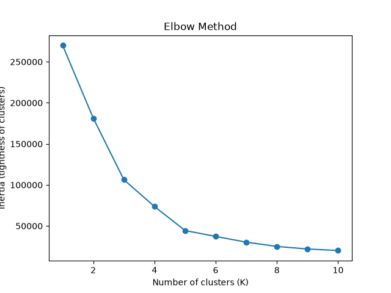
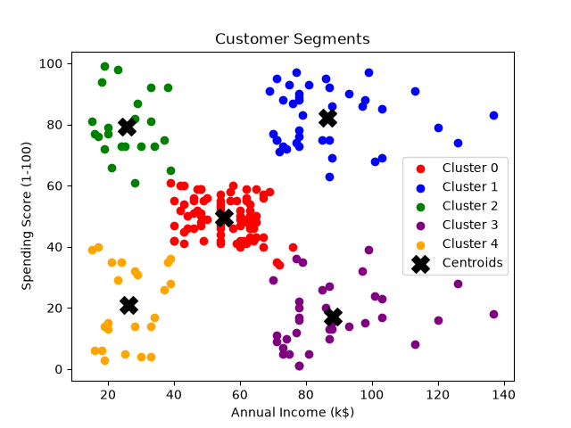

# SCT_ML_2 - Customer Segmentation (K-Means Clustering)

## Task
Group mall customers into segments based on purchase history using K-means clustering.

## Approach
- Dataset: Kaggle "Mall Customer Segmentation Data" (Mall_Customers.csv)
- Features used: Annual Income (k$), Spending Score (1-100)
- Model: scikit-learn KMeans
- Optimal K selected using the Elbow Method

The elbow plot shows inertia (cluster tightness) dropping sharply then leveling off around K=5, indicating that's the optimal number of clusters.

## Results
- Optimal number of clusters: K = 5

## Customer Segments Identified
1. **Low income, high spending** - budget-conscious but high spenders
2. **Low income, low spending** - cautious, budget-focused shoppers
3. **Medium income, medium spending** - average/typical customers
4. **High income, high spending** - most valuable customer segment
5. **High income, low spending** - high potential, currently underspending

## How to run
1. Install dependencies: `pip install pandas scikit-learn matplotlib`
2. Ensure `Mall_Customers.csv` (Kaggle dataset) is in the same folder
3. Run: `python customer_clustering.py`
4. Outputs: `elbow_plot.png` and `customer_clusters.png` will be generated